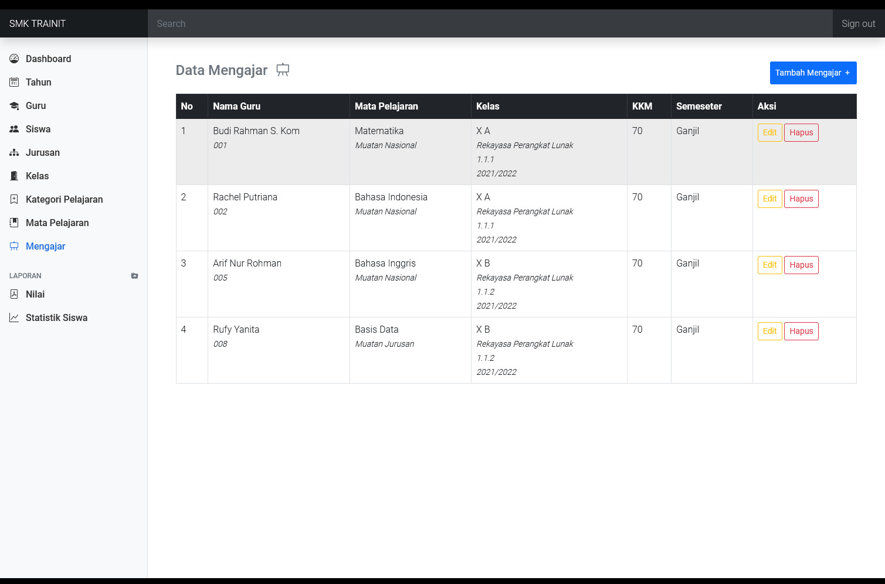

# Sistem Informasi Akademik Sekolah SMK

1. Apa aplikasi/sistem yang mau dibuat ?
   sistem informasi akademik smk

2. Siapa yang mau memakai sistem ?
   admin
   guru
   siswa

3. Apa yang dilakukan admin di sistem ?

   - melakukan login
   - mengelola data tahun ajaran
   - mengelola data siswa
   - mengelola data guru
   - mengelola data kategori
   - mengelola data mapel (tiap mapel ada kategorinya)
   - mengelola data jurusan
   - mengeola data kelas (tiap kelas ada jurusannya dan ada tahun angkatannya)
   - mengelola kenaikan kelas
   - mengelola data mengajar (guru siapa ? memegang mapel apa? tahun ajaran berapa?)
   - mengelola data siswa_kelas (tiap kelas terdapat beberapa siswa)
   - melihat/cetak data nilai

4. Apa yang dilakukan guru di sistem ?

   - melakukan login
   - mengubah profil guru
   - menginputkan nilai dari mata pelajaran yang diajar guru untuk siswa kelas tingkat tertentu (kelas x)

5. Apa yang dilakukan siswa di sistem ?

   - melakukan login
   - set tahun ajaran
   - mengubah profil siswa
   - melihat nilai

6. Seperti apa skema basis datanya ?
   - users (id, username, password, nama)
   - tahun_ajaran (id_tahun, tahun_ajaran)
   - siswa (id_siswa, id_tahun, induk_siswa, password_siswa, nama_siswa, kelamin_siswa, foto_siswa, alamat_siswa)
   - guru (id_guru, induk_guru,password_guru, kelamin_guru, foto_guru, alamat_guru)
   - kategori (id_kategori, nama_kategori)
   - mapel (id_mapel, id_kategori, nama_mapel)
   - kelas (id_kelas, id_jurusan, id_tahun, nama_kelas, ruang_kelas, jenjang_kelas)
   - siswa_kelas (id_siswakelas, id_siswa, id_kelas)
   - mengajar (id_mengajar, id_guru, id_tahun, id_mapel, id_kelas, kkm, semester)
   - nilai (id_nilai, id_mengajar, id_siswa_kelas, h1, h2, h3, h4, h5 ,6 h7, h8, rph, pts, hpap, prep, k1,k2,k3,k4,k5,k6, k7, k8, hpak, prek)

Guru
Geografi --> al biruni --> 2020/2021 2021/2022 ptolemeus
Geografi --> ibnu kholdun

setiap siswa setiap tahun memiliki data nilai berbeda (kenaikan kelas)
sehingga minimal harus ada 3 nilai saat menempuh pendidikan selama tiga tahun di smk

## Screenshot

## Release Date

Januari 2022
